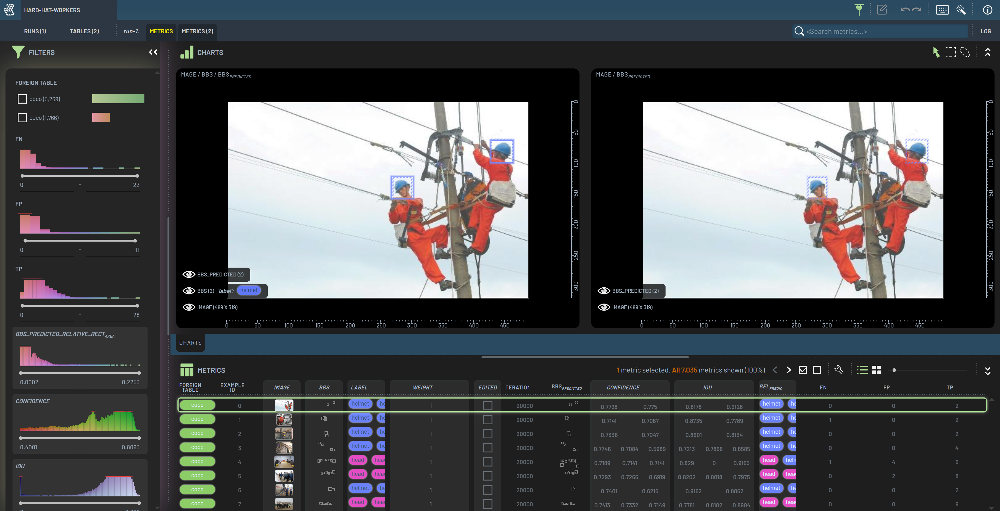

# 3LC Integration

This document outlines how to use the 3LC integration available for YOLOv8 classification and object detection.

For any questions or problems, please reach out on the [3LC Discord](https://discord.com/channels/1236027984150794290/1236118620002586655).

## About 3LC

[3LC](https://3lc.ai) is a tool which enables data scientists to improve machine learning models in a data-centric fashion. It collects per-sample predictions and metrics, allows viewing and modifying the dataset in the context of those predictions in the 3LC Dashboard, and rerunning training with the revised dataset.

3LC is free for non-commercial use.



## Getting Started

The first step is to clone this fork, change directory into it and install the package and requirements into a virtual environment:
```bash
git clone https://github.com/3lc-ai/ultralytics.git
cd ultralytics
python -m venv .venv
source .venv/bin/activate # or .venv/Scripts/activate in Git Bash / Windows
pip install -e . # install the local ultralytics fork package
pip install 3lc # install 3lc
pip install pacmap # or umap-learn (only required for embeddings collection)
```

In order to create a `tlc.Run` with the integration, instantiate `TLCYOLO` (instead of `YOLO`) and call the method `.train()` like usual:
<details>
<summary>Code Example</summary>
The following code example shows basic usage of the 3LC integration. The `Settings` object can be used to specify 3LC specific settings. For more details, see the
customization section.

```python
from ultralytics.utils.tlc import Settings, TLCYOLO

# Set 3LC specific settings
settings = Settings(
    project_name="my_yolo_project",
    run_name="my_yolo_run",
    run_description="my_yolo_run_description",
)

# Initialize and run training
model = TLCYOLO("yolov8n.pt") # Or e.g. "yolov8n-cls.pt" for classification
model.train(data="coco128.yaml", settings=settings) # See the section 'Dataset Specification' for how to specify which data to use
```
</details>

In the background, 3LC will create `tlc.Table`s and collect metrics with the trained mode after training completes, which can be opened in the 3LC Dashboard.

## Dataset specification


Different tasks require datasets with different formats. This section outlines how to register your dataset with 3LC for the different Ultralytics tasks.

<details>
<summary>Classification</summary>
For image classification, there are two ways to specify which data to use during training and metrics collection.

1. Using the argument `data` like usual when calling `model.train(data=path/to/dataset)`. See the [Ultralytics Documentation](https://docs.ultralytics.com/datasets/classify/). This will create `tlc.Table`s for each split, with the dataset name set to the last part of the dataset path. On rerunning the same command, the same `Table`s will be used. If new revisions have been created for these `Table`s in the 3LC Dashboard, the latest versions will be used instead. This way of specifying the data is useful when you are using the 3LC integration for the first time.

1. Using the argument `tables` when calling `model.train(tables={"train": my_train_table, "val": my_val_table})`. Here `my_train_table` and `my_val_table` need to be instances of `tlc.Table` or paths to tables in the form of a `tlc.Url`, `pathlib.Path` or `str`. In this case the provided `tlc.Table`s will be used as provided. This way of specifying the data is useful when you would like to use specific versions of your data (i.e. not necessarily 'latest'), or if you have created your own `tlc.Table`s and would like to use them instead.

If your `tlc.Table`s have custom column names for your image and label columns, you can provide these as additional arguments `image_column_name` and `label_column_name`. The defaults are `Image` and `Label`.
</details>

<details>
<summary>Object Detection</summary>
For object detection, there are three ways to specify which data to use during training and metrics collection.

1. Using the argument `data` like usual when calling `model.train(data=path/to/dataset.yaml)`. See the [Ultralytics Documentation](https://docs.ultralytics.com/datasets/detect/). This will create `tlc.Table`s for each split. On rerunning the same command, the same `Table`s will be used. If new revisions have been created for these `Table`s in the 3LC Dashboard, the latest versions will be used instead. This way of specifying the data is useful when you are using the 3LC integration for the first time.

1. Using the argument `data` like usual, but providing the path to a 3LC Dataset YAML file. The way to specify this is by adding a prefix `3LC://` to the path. ..

1. Using the argument `tables` when calling `model.train(tables={"train": my_train_table, "val": my_val_table})`. ...

</details>

<details>
<summary>Segmentation (not supported)</summary>
The 3LC integration does not yet support the Segmentation task. Stay tuned on [Discord](https://discord.com/channels/1236027984150794290/1236118620002586655) to learn when support is added!
</details>

<details>
<summary>Pose Estimation (not supported)</summary>
The 3LC integration does not yet support the Pose Estimation task. Stay tuned on [Discord](https://discord.com/channels/1236027984150794290/1236118620002586655) to learn when support is added!
</details>

<details>
<summary>OBB (oriented object detection) (not supported)</summary>
The 3LC integration does not yet support the Oriented Object Detection task. Stay tuned on [Discord](https://discord.com/channels/1236027984150794290/1236118620002586655) to learn when support is added!
</details>

## 3LC Settings

The integration offers a rich set of settings and features which can be set through an instance of `Settings`. They allow specifying which metrics to collect, how often to collect them, and whether to use sampling weights during training.

The available 3LC settings can be seen in the `Settings` class in [settings.py](detect/settings.py).

Providing invalid values (or combinations of values) will either log an appropriate warning or raise an error, depending on the case.

### Image Embeddings

Image embeddings can be collected by setting `image_embeddings_dim` to 2 or 3, and are based on the output of the spatial pooling function output from the YOLOv8 architectures. Similar images, as seen by the model, tend to be close to each other in this space. In the 3LC Dashboard these embeddings can be visualized, allowing you to find similar images, duplicates and imbalances in your dataset and determine if your validation set is representative of your training data (and vice-versa).

Note that when collecting image embeddings for validation only runs, `reduce_all_embeddings()` must be called at the end to produce embeddings which can be visualized in the Dashboard.

## Other output

When viewing all your YOLOv8 runs in the 3LC Dashboard, charts will show up with per-epoch validation metrics for each run. This allows you to follow your runs in real-time, and compare them with each other.

# Frequently Asked Questions

## What is the difference between before and after training metrics?

By default, the 3LC integration collects metrics only after training with the `best.pt` weights written by YOLOv8. These are the after training metrics.

If a starting metrics collection epoch is provided (optionally with an interval), metrics are also collected during training, this time with the exponential moving average that YOLOv8 uses for its validation passes.

## What happens if I use early stopping? Does it interfere with 3LC?

Early stopping can be used just like before. Unless metrics collection is disabled, final validation passes are performed over the train and validation sets after training, regardless of whether that is due to early stopping or completing all the epochs.

## Why is embeddings collection disabled by default?

Embeddings collection has an extra dependency for the library used for reduction, and a performance implication (fitting and applying the reducer) at the end of a run. It is therefore disabled by default.

## How do I collect embeddings for each bounding box?

In order to collect embeddings (or other additional metrics) for each bounding box, refer to the [3LC Bounding Box Example Notebooks](https://docs.3lc.ai/3lc/latest/public-notebooks/add-bb-embeddings.html).
